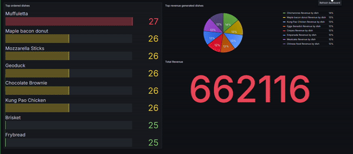

# Real-time restaurant order analytics
Using repo, you can create fake order with on pre-populated drinks, restaurants, dishes information. 



# Setup

You need docker to run the repository successfully. 

Command below will start apache kafka, postgresql instance, grafana for you.

```shell
docker-compose up
```

Then you need to head over to the [localhost:3000](http://localhost:3000) where your Grafana instance exists.
The initial username / password is:
- admin
- admin

You directly go to the dashboards where you will see the dashboard restaurant automatically provisioned for you.
Only thing you need to do right now is come back to the repository, and run fake data generator by command:
```shell
python -m src.generate
```
Which will start to generate fake orders!
Then in order to add them into the **PostgreSQL** database, you start `db_consumer.py` by using
```shell
python -m src.db_consumer
```
Which will initiate the database writes, and then you can see the values appearing in the dashboard!

Have fun!